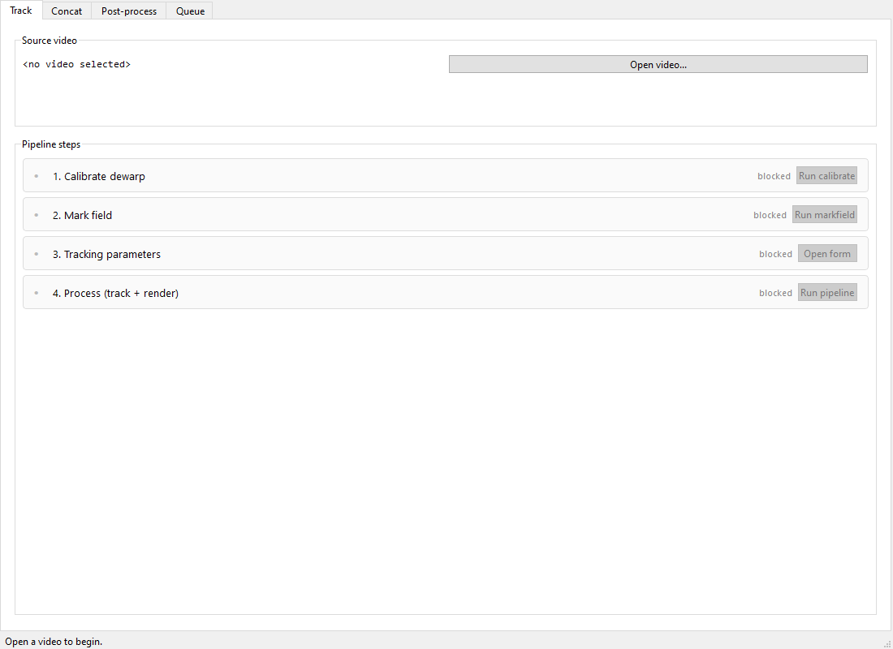
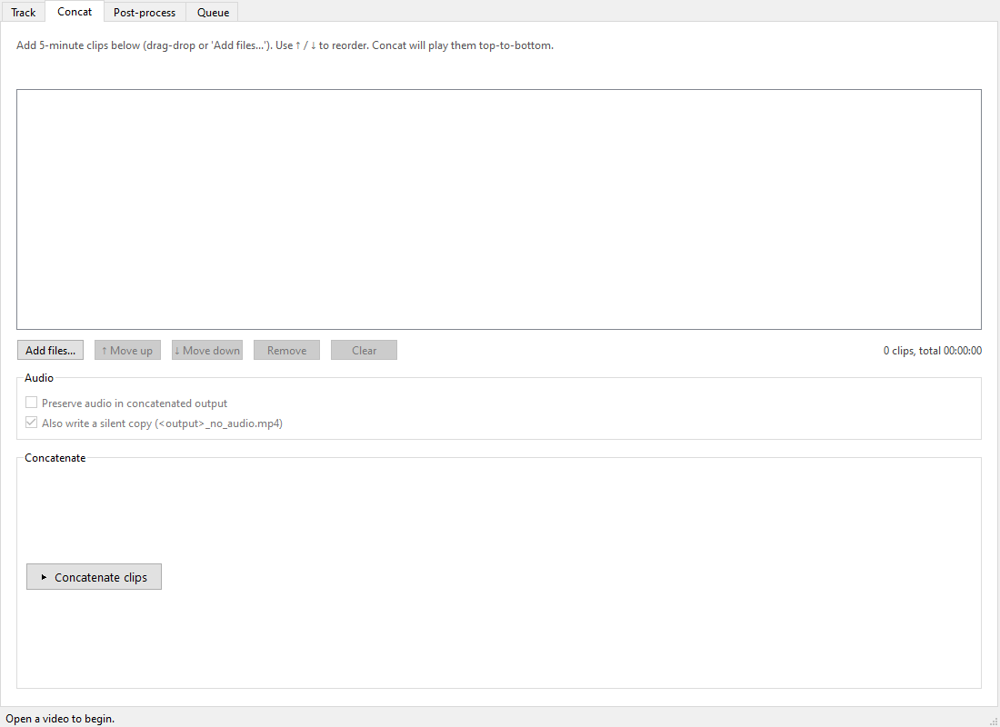
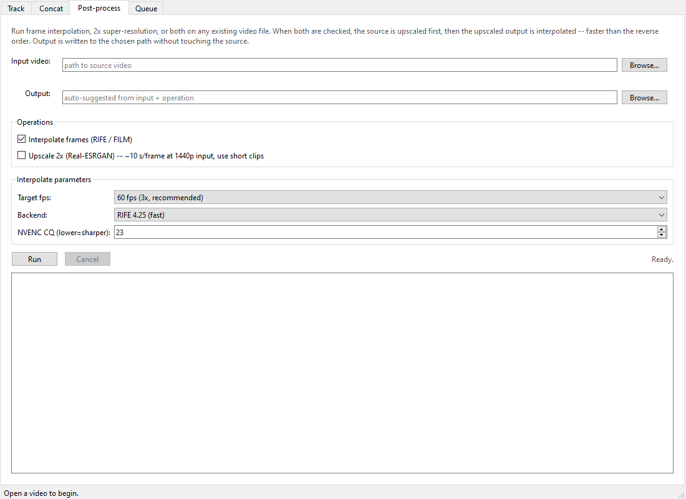
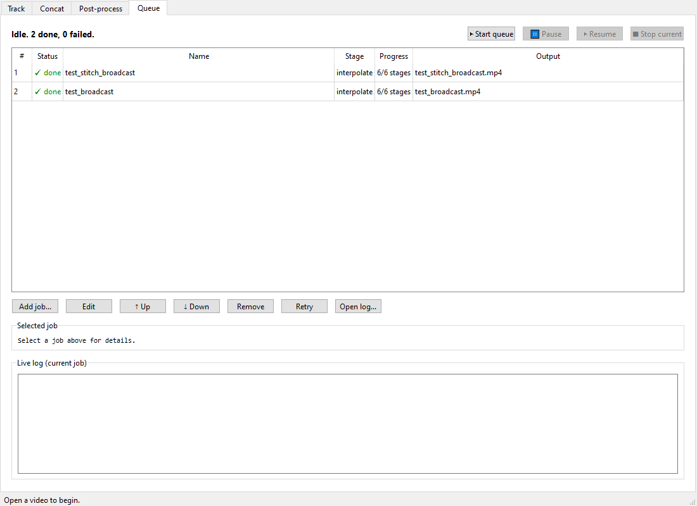
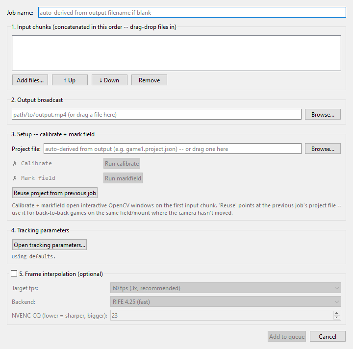

# Waruka GUI Reference (v1.0.0)

This document walks through the GUI tab by tab. For the CLI reference,
see [`cli_reference.md`](cli_reference.md). For a snapshot
of what changed in this release, see "What's new in v0.16" at the top
of the CLI reference.

The GUI is launched with:

```bash
python -m waruka gui
```

It is a PySide6 (Qt 6.11) tabbed shell with four tabs:

1. **Track** — single-clip end-to-end pipeline (calibrate -> markfield
   -> tracking parameters -> process).
2. **Concat** — join 5-min Reolink chunks into one match video with
   optional trim, audio + codec consistency checks.
3. **Post-process** — run interpolation and/or 2x upscaling against
   any existing video.
4. **Queue** — overnight batch processor. Set up many games, hit
   Start, sleep.

Subprocess work (calibrate, markfield, track, render, interpolate,
upscale, ffmpeg concat) runs as `python -m waruka <subcommand>` or
`ffmpeg` invocations under the hood. The GUI never duplicates business
logic — it sequences and surfaces the same CLI you can drive
manually.

---

## Track tab



End-to-end driver for a single source clip. After opening (or
drag-dropping) a video, the four-step flow is:

1. **Calibrate** — opens the OpenCV calibrate window. Auto-skipped
   if the existing `project.json` already has dewarp.
2. **Mark field** — opens the OpenCV markfield window. Auto-skipped
   if the project already has a homography + corners.
3. **Tracking parameters** — opens the `ParamsDialog` for stride,
   t0/t1, mode (sequential vs pipeline), view-mode, SR toggle,
   audio companion file, and post-render interpolation.
4. **Process** — runs `track -> classify -> campath -> render` (or
   `waruka pipeline` if mode=pipeline) plus the audio mux step.

Artefacts are written to `<source_dir>/waruka_tracking/<basename>/`;
the final tracked video lands at
`<source_dir>/<basename>_tracked.mp4`. Live progress + Kill button
via the same `_progress.json` mechanism the CLI `waruka monitor` uses.

---

## Concat tab



Multi-clip concatenation for matches recorded as 5-minute Reolink
chunks. Workflow:

1. **Add files** (browse or drag-drop). The list shows monospace
   columns: filename, recorded datetime parsed from the Reolink
   `_DST<date>_<time>_` pattern, duration, audio indicator, codec,
   resolution, fps.
2. **Stream-consistency panel** flags audio mismatches (some have
   sound, some don't) and codec mismatches (4K-mode chunks among
   1440p ones). One-click remediation buttons drop the odd ones
   out.
3. **Reorder** with ↑/↓ buttons; remove individual files; clear all.
4. **Scrubber** (cv2-based) for trim selection: `,` `.` `<` `>` for
   ±1s / ±10s; `I` / `O` for in/out markers; Space to play. Output
   `_no_audio.mp4` silent companion is optional.
5. **Save** runs `ffmpeg -c copy` concat with live progress + Kill
   button, then auto-hands off to the Track tab with the trimmed
   file pre-loaded.

---

## Post-process tab (v0.16)



Run frame interpolation and/or 2x upscaling against any existing
video. Two checkboxes:

* **Interpolate frames (RIFE / FILM)** — target fps (40 / 60 / 80),
  backend (RIFE / FILM-style; FILM is much slower), NVENC CQ knob.
* **Upscale 2x (Real-ESRGAN)** — ~10 s/frame at 1440p, so really
  intended for short clips.

When **both** are checked the source is upscaled first to a temp
file then interpolated to the final output. Math: with `N` source
frames at multiplier 3, SR runs `N` times in the upscale-first
order vs `3N` times if interp ran first; net ~3x faster overall.

Stage progress shows in the log pane (`Stage 1/2: Upscale 2x...`,
then `Stage 2/2: Interpolate...`). Temp intermediates are cleaned
up on success, failure, **or** cancel.

Both operations are also available as standalone CLI commands —
see `waruka interpolate` and `waruka upscale` in the CLI reference.

---

## Queue tab (v0.16)



Overnight batch processor. Set up many games end-to-end, then start
the queue before sleeping. Per-job state survives Waruka crashes /
restarts.

**Header controls:**

* **Start queue** — begins running pending jobs sequentially.
* **Pause** — current stage runs to completion, then the queue
  stops at the next stage boundary.
* **Resume** — kicks the queue back off.
* **Stop current** — kills the running subprocess and marks the
  job interrupted (completed stages are preserved; use Retry
  later).

**Jobs table** shows # / Status / Name / Stage / Progress / Output.
Status icons: ⏸ pending, ▶ running, ✓ done, ✗ failed, ⚠ interrupted.

**Row buttons:** Add job, Edit, ↑ Up, ↓ Down, Remove, Retry,
Open log...

**Retry** re-runs from the first failed/incomplete stage of a job —
completed stages stay completed so a failed render doesn't force a
fresh concat or track run.

**Details panel** shows the selected job's full configuration and
the per-stage progression with elapsed times.

**Live log** mirrors the currently-running job's stdout/stderr.
Each job's full log is also archived to
`<artefact_dir>/job.log` for later inspection.

### Add-job dialog



Mirrors the Track tab in spirit:

1. **Input chunks** — drag-drop files in or click "Add files...";
   drag inside the list to reorder.
2. **Output broadcast** — file picker; the project.json path
   below auto-derives to
   `<broadcast_dir>/waruka_tracking/<basename>/project.json`.
3. **Setup** — Run calibrate / Run markfield buttons. Both use
   the first input chunk as their source. Status pips flip from
   ✗ to ✓ as each step completes. **Reuse project from previous
   job** copies the most-recently-added job's project path —
   intended for back-to-back games on the same field/mount where
   the camera hasn't moved.
4. **Tracking parameters** — "Open tracking parameters..." opens
   the same `ParamsDialog` the Track tab uses (stride, t0/t1,
   mode, view-mode, SR, audio companion file, interpolation
   pre-selection). A summary line shows the active settings.
5. **Frame interpolation** (optional) — fps / backend / CQ.

**Add to queue** is gated on:
* At least one input chunk
* Output path set
* Calibrate + markfield both done (or an external project
  pointed to via Browse... that already has homography)

### Stage layout

Each queued job runs as:

```
concat? -> track -> classify -> campath -> render -> audio_mux? -> interpolate?
```

* `concat` skips for single-input jobs.
* `audio_mux` inserts whenever the first chunk has audio (matches
  the Track tab's behaviour). Render outputs to a silent
  intermediate, audio_mux merges in source audio.
* Mode = pipeline (set via tracking parameters dialog) collapses
  `track + classify + campath + render` into a single
  `waruka pipeline` stage. Currently sequential is recommended
  until #21 (chunk-0 ~5° framing residual on the first chunk
  of a long match) is fixed.

### Persistence + crash recovery

* Queue state at `~/.waruka/queue.json`, atomic writes on every
  mutation.
* On reload, any job whose status was `running` flips to
  `interrupted` so it's visible and retryable.
* All intermediates (JSON, concat list, concat'd video, silent
  render, pipeline chunks, log) land in
  `<broadcast_dir>/waruka_tracking/<basename>/`.
* Final outputs (`broadcast.mp4`,  `broadcast_smooth.mp4`,
  `broadcast_no_audio.mp4`) stay where you pick them.

---

## Tracking parameters dialog (shared by Track + Queue)

Both the Track tab's "Tracking parameters" button and the Queue
tab's Add-job "Open tracking parameters..." button open the same
`ParamsDialog`. Fields:

| Field | Purpose |
|---|---|
| **Start time / End time** | Process window in seconds. Empty = full clip. Validator caps at the probed duration (Queue uses sum of all input chunks). |
| **Processing mode** | `Sequential` (pixel-perfect, default) or `Pipeline` (chunked, ~33-50% faster; small first-20s framing drift). |
| **Detection stride** | Detection runs every Nth source frame. Default 3 = production v0.12 default. |
| **View mode** | `Default` (tight, natural) or `Wide` (more breathing room). |
| **Audio** | When source has audio, the tracked output preserves it by default. Optional checkbox also writes a silent `_no_audio.mp4` companion. |
| **Frame interp** | Off / 40 / 60 / 80 fps + backend (RIFE / FILM). FILM picks trigger a red WARNING with the multi-day runtime estimate. |
| **Upscale** | Real-ESRGAN x2 on the source crop during render (in-renderer SR, not the post-render `waruka upscale`). Adds 5-10x render time. |
| **Output video** | The final tracked broadcast path. Pre-filled from `WarukaPaths`. |

The same dialog drives both the Track tab's process step and the
Queue tab's stored job parameters, so the two stay in parity by
construction.

---

## Where intermediates live

| Tab | Intermediate location | Final output |
|---|---|---|
| Track | `<src_dir>/waruka_tracking/<basename>/` | `<src_dir>/<basename>_tracked.mp4` |
| Concat | inside its own work dir; ffmpeg-concat output at user-picked path | user-picked path |
| Post-process | None (single-stage; or temp .mp4 next to output when interp+SR chained) | user-picked path |
| Queue | `<broadcast_dir>/waruka_tracking/<basename>/` (JSON, concat'd video, silent intermediate, pipeline chunks, log) | broadcast / smooth / no_audio at user-picked paths |

---

## Keyboard / pointer shortcuts

| Where | Keys |
|---|---|
| Calibrate window | `q` quit, mouse to drag aim |
| Markfield window | Left-click to add a mark; right-click to remove nearest; click+drag to move a mark; `T` toggle auto-classify mode; `G` guides; `H` fit box; `,` `.` `<` `>` scrub ±1s/±10s |
| Calibrate preview | Left-drag pan yaw/pitch; mouse wheel zoom vfov (25-110°); right-drag the level line vertically; `0` re-centre level line; `L` toggle level line; `O` toggle calibrated-line overlay |
| Concat scrubber | `,` `.` `<` `>` scrub ±1s/±10s; `I` / `O` set in/out markers; Space toggles play |

---

## Live progress

Long-running stages (`track`, `render`, `pipeline`, `interpolate`,
`upscale`) write `_progress.json` to their cwd as they run. The GUI
polls this file every 500 ms and updates the stage's progress bar
and ETA. The same file is what `python -m waruka monitor` reads,
which means running the monitor in a second terminal alongside a
CLI invocation gives the same UX.

For the Queue tab, the runner sets cwd to each job's artefact dir
so progress lands at
`<broadcast_dir>/waruka_tracking/<basename>/_progress.json`.
